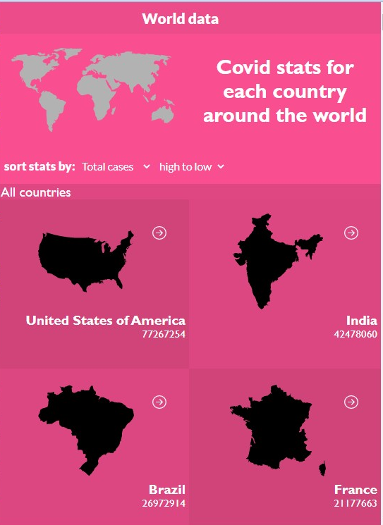
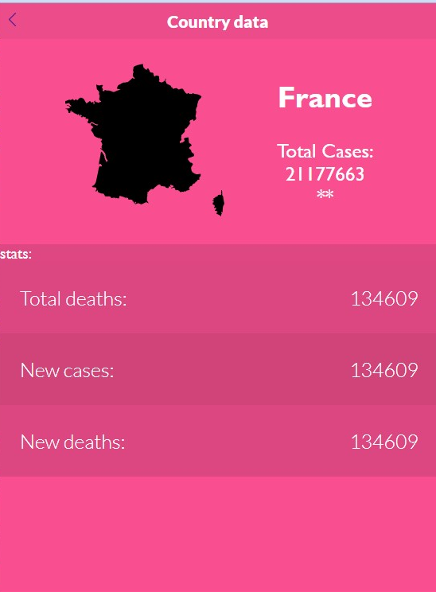

<p align="left">
  <a href="https://www.microverse.org/">
    
  </a>
</p>

# Covid-Stats-App
The Covid-stats-app allows users to have access to the latest covid data in Spain. They can also filter by region name, as well as get more informations on that specific region by clicking on it.

## Live Demo 👀

- [Live Demo Link](https://covid19-stat-app.herokuapp.com/)

## Video Demo 👀

- [Video Demo Link](https://www.loom.com/share/4db96eba991e46bb87a1f2652087fa93)

| main Page | info Page |
| --- | --- |
|  |  |

## Built With

- HTML, CSS, React & Redux;
- Visual Studio, Git & GitHub;
- [Narrativa API](https://api.covid19api.com/summary).

## Getting Started

### Running locally
To run this project, you only need a computer with a browser (like Google Chrome, Mozilla Firefox, Microsoft Edge, Apple Safari, etc.) installed, and follow these steps:

1. In your terminal, type the following, to clone this repository:

```sh
$ git clone https://github.com/kingqabil/covid-status-app.git
```

2. After, run the following commands in your terminal:

```sh
$ cd covid-stats-app
$ npm install
$ npm start
```
<details align="right">
<summary><small>What are these commands?</summary>
- the `$ cd` command is used to move to different folders. <br>
- `$ npm install` install all the required dependencies to run the project.
- while `$ npm run start` runs the app in the development mode.</small>
</details>


3. If your default browser do not start automatically, open it and type `http://localhost:3000` to run the application.

### Running tests
To launch the test runner in the interactive watch mode, run `$ npm test` in your console.
> To read more information about running tests, visit [create react app website](https://create-react-app.dev/docs/running-tests/);

## Author 👤

👤 **SadiQ HabiL**

- GitHub: [@kingqabil](https://github.com/kingqabil)
- Twitter: [@kingqabil](https://twitter.com/kingqabil)
- LinkedIn: [@kingqabil](https://linkedin.com/in/kingqabil)

## ⭐️ Acknowledgments

Original design by [Nelson Sakwa on Behance](https://www.behance.net/sakwadesignstudio).

## 🤝 Contributing

Contributions, issues, and feature requests are welcome!

Feel free to check the [issues page](https://github.com/kingqabil/covid-status-app/issues).

## 📝 License

This project is [MIT](./LICENSE) licensed.
